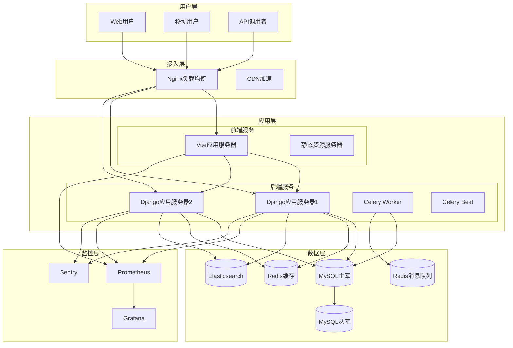
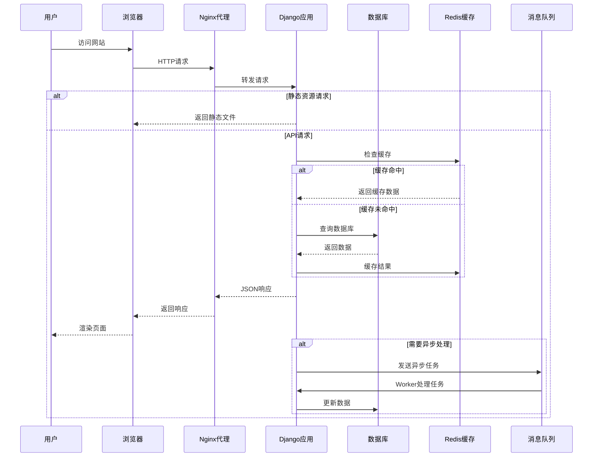
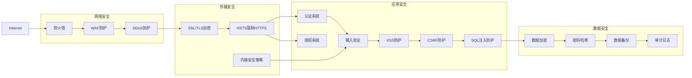
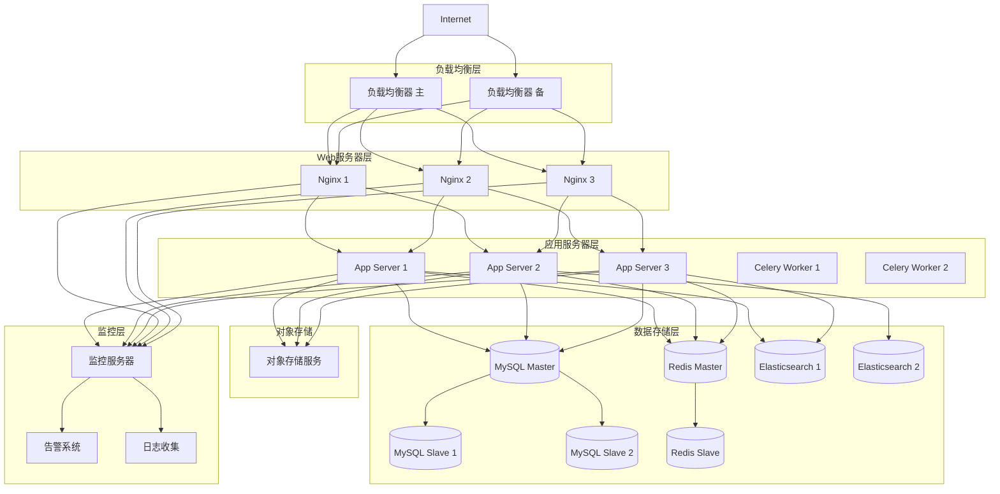
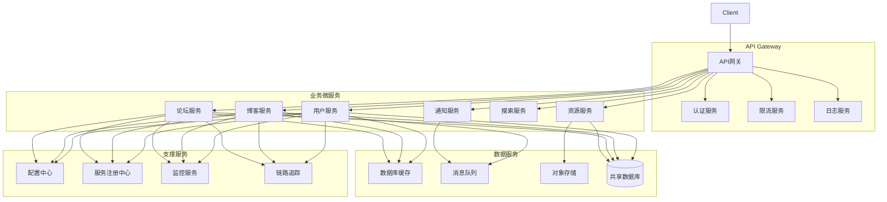

# 🏗️ 系统架构文档

## 一、总体架构概览
1. **架构风格**: 单体架构，采用 Django + Vue3 前后端分离模式。选择理由：项目规模适中，单体架构开发和部署更简单，维护成本低，同时前后端分离保证了开发效率和用户体验。

2. **技术栈分层**:
   - 展示层 (Presentation Layer): Vue 3 + TypeScript + Element Plus
   - 业务逻辑层 (Business Logic Layer): Django 视图和服务
   - 数据访问层 (Data Access Layer): Django ORM
   - 基础设施层 (Infrastructure Layer): Redis、MySQL、Celery

3. **部署架构**: 生产环境采用 Nginx 反向代理，Django 应用服务器集群，MySQL 主从复制，Redis 缓存和消息队列。

## 二、技术栈详细说明

### 2.1 前端技术栈
```
Vue 3 + TypeScript + Composition API
├── 核心框架: Vue 3.3.4
├── 路由管理: Vue Router 4
├── 状态管理: Pinia 2
├── UI框架: Element Plus
├── 构建工具: Vite 4
├── 代码规范: ESLint + Prettier
└── 测试框架: Vitest + Playwright
```

### 2.2 后端技术栈
```
Django 4.2 + Django REST Framework
├── Web框架: Django 4.2
├── REST API: Django REST Framework 3.14
├── 数据库: MySQL 8.0 + SQLite (开发)
├── 缓存: Redis 7
├── 消息队列: Celery + Redis
├── 认证授权: JWT + Django内置认证
└── 安全防护: CSRF, CORS, XSS防护等
```

## 三、系统模块划分

### 3.1 核心业务模块
1. **用户管理模块**
   - 用户注册/登录/认证
   - 权限管理系统 (RBAC)
   - 个人资料管理

2. **博客系统模块**
   - 文章管理 (CRUD)
   - 分类标签系统
   - 评论互动系统

3. **论坛系统模块**
   - 帖子管理
   - 回帖系统
   - 分区管理

4. **资源管理模块**
   - 资源上传/下载
   - 资源分类
   - 资源审核

### 3.2 支撑模块
1. **文件管理模块**: 图片/文件上传处理
2. **搜索模块**: 全文搜索功能
3. **通知模块**: 站内信和邮件通知
4. **统计模块**: 访问统计和数据分析

## 四、数据流设计

### 4.1 用户请求处理流程
```
用户请求 → Nginx → Django中间件 → 路由分发 → 视图处理 → 
序列化器 → 模型操作 → 数据库 → 响应返回
```

### 4.2 异步任务处理流程
```
触发异步任务 → Celery任务队列 → Worker处理 → 
Redis存储结果 → 前端轮询获取结果
```

## 五、数据库设计

### 5.1 核心表结构
1. **用户表 (users_user)**
2. **文章表 (blog_article)**
3. **帖子表 (forum_thread)**
4. **资源表 (resources_resource)**

### 5.2 数据关系图
使用Mermaid语法描述实体关系

## 六、API架构

### 6.1 RESTful API设计原则
- 资源命名规范
- HTTP方法使用规范
- 状态码使用规范
- 版本控制策略

### 6.2 认证授权架构
- JWT令牌认证流程
- 权限校验机制
- 访问控制列表 (ACL)

## 七、安全架构

### 7.1 网络安全
- HTTPS强制使用
- CSP策略配置
- 防火墙规则

### 7.2 应用安全
- 输入验证和过滤
- SQL注入防护
- XSS/CSRF防护
- 文件上传安全

### 7.3 数据安全
- 敏感数据加密
- 密码哈希存储
- 数据备份策略

## 八、性能优化架构

### 8.1 前端优化
- 代码分割和懒加载
- 图片优化策略
- 缓存策略

### 8.2 后端优化
- 数据库查询优化
- Redis缓存策略
- 连接池配置

### 8.3 CDN和静态资源
- 静态资源CDN分发
- 浏览器缓存策略

## 九、监控和日志

### 9.1 监控系统
- 应用性能监控
- 错误追踪 (Sentry)
- 业务指标监控

### 9.2 日志系统
- 访问日志
- 错误日志
- 业务日志
- 审计日志

## 十、部署架构

### 10.1 开发环境
- Docker Compose本地开发
- 热重载配置

### 10.2 生产环境
- 多节点部署
- 负载均衡配置
- 数据库主从复制
- 高可用设计

## 十一、扩展性设计

### 11.1 水平扩展
- 无状态服务设计
- 会话共享方案

### 11.2 垂直扩展
- 数据库分库分表方案
- 读写分离设计

## 十二、容灾和备份

### 12.1 容灾方案
- 多可用区部署
- 故障转移策略

### 12.2 备份策略
- 数据库备份
- 文件备份
- 配置备份

## 十三、技术决策记录 (ADR)
记录重要的技术决策和理由

## 十四、架构图

### 1. 整体架构图


### 2. 数据流图


### 3. 安全架构图


### 4. 部署架构图


### 5. 微服务架构图（可扩展）
